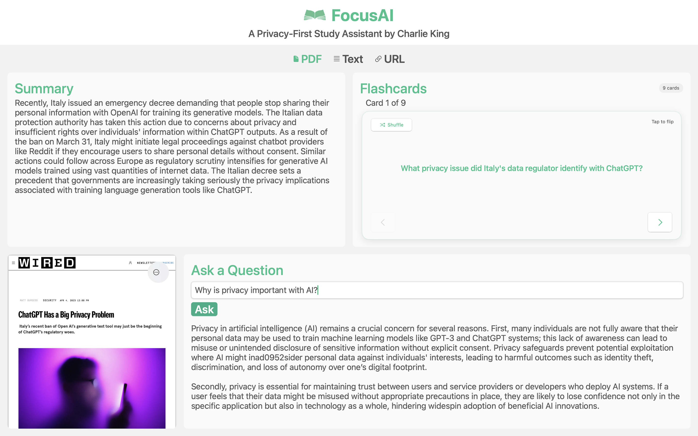

# FocusAI

FocusAI is a privacy-first macOS study assistant written in Swift. It summarizes PDFs, generates flashcards, and 
answers questions—all locally on-device. Designed for students like me, it offers offline functionality, user 
privacy, and a distraction-free experience. This is an ongoing personal project inspired by my interest in usable, ethical AI.

## Features

- **Document Processing**: Upload PDFs, paste text, or load web pages
- **AI Summarization**: Get comprehensive summaries using local AI
- **Flashcard Generation**: Automatically create study flashcards
- **Question Answering**: Ask questions about your documents
- **Complete Privacy**: Everything runs locally on your Mac
- **Offline Capability**: App is fully functional offline
- **Optimized Performance**: Smart chunking and parallel processing for speed

## Demo

  
  
<em>FocusAI in action: Processing a Wired article about AI privacy, showcasing document analysis, AI summarization, flashcard generation, and contextual Q&A features.</em>

